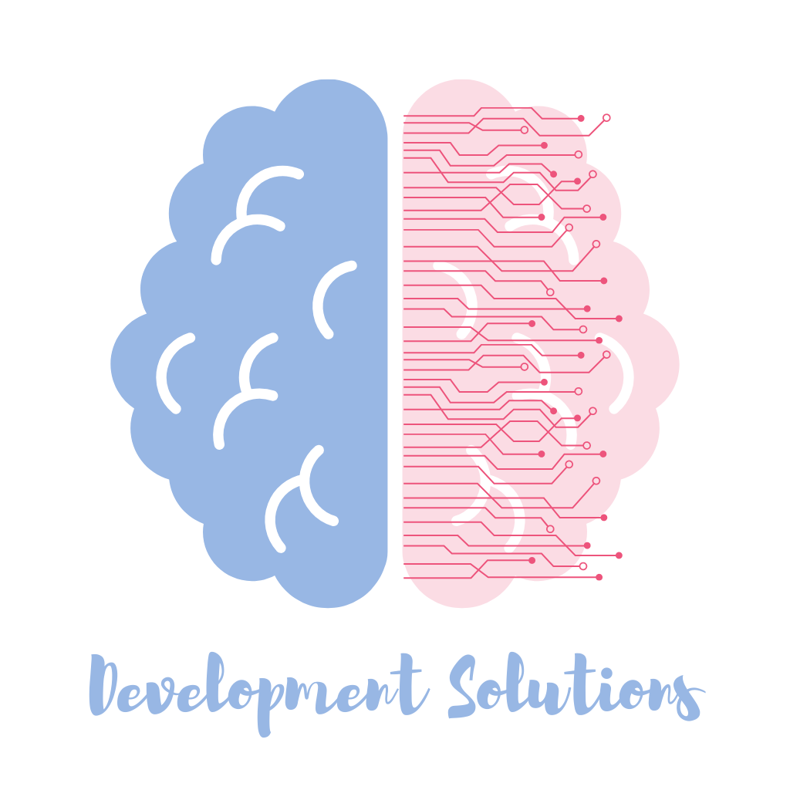

# Development Solutions Inc.
> Oficina de planeación de proyectos.

## Contenido
* [Misión](https://github.com/KarenMacias/DevelopmentSolutionsInc/blob/main/README.md#misi%C3%B3n)
* [Visión](https://github.com/KarenMacias/DevelopmentSolutionsInc/blob/main/README.md#visi%C3%B3n)
* [Valores](https://github.com/KarenMacias/DevelopmentSolutionsInc/blob/main/README.md#valores)
* [Documentación](https://github.com/KarenMacias/DevelopmentSolutionsInc/blob/main/README.md#documentaci%C3%B3n)
* [Minutas](https://github.com/KarenMacias/DevelopmentSolutionsInc/blob/main/README.md#minutas)
## Misión
Liderar los proyectos de nuestros clientes por medio de soluciones creativas con el objetivo de brindar un producto de calidad que cumpla con los requerimientos solicitados de manera eficiente.
## Visión
Proporcionar las mejores herramientas de software a nuestros clientes para que sus proyectos superen sus propias expectativas y tengan un impacto positivo.
## Valores
* *Responsabilidad*
* *Compromiso*
* *Calidad*
* *Liderazgo*
* *Integridad*
* *Creatividad*
* *Colaboración*
* *Respeto*
## Documentación
* [Documentación completa](https://drive.google.com/drive/folders/12nPx9I1TrRJ33cQoWU3dUTufNOV_qjG1?usp=sharing).
* [Minutas](https://drive.google.com/drive/folders/1tw0YUBnjjZ7dhdbjQAzlkAHZQ68_STKr?usp=sharing).
* Docuemntación PMO link
* Project Charter link
## Minutas
* Minuta 1 link
* Minuta 2 link
